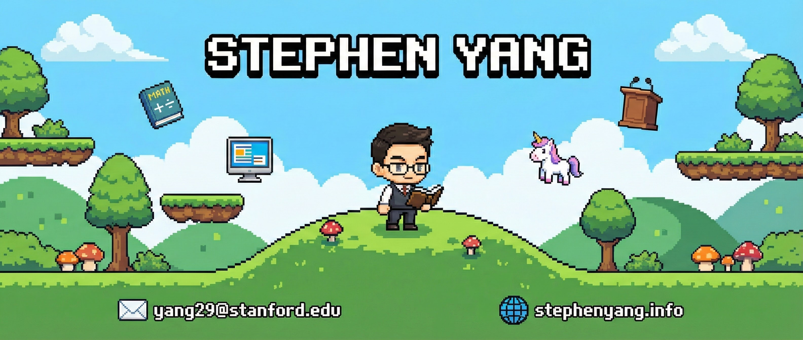

# Hey, I'm Stephen Yang

  **Co-founder & CEO @ [SuperScored.ai](https://superscored.ai)** | Stanford Math & CS (On Leave)

  Building AI-powered education technology. Previously researching LLMs, innovation economics, and political economy
   at Stanford.

  ---

  ### What I'm Working On

  **SuperScored.ai** - An AI edtech startup reimagining how students learn and succeed.

  ### Research Background

  My academic work sits at the intersection of AI/ML and social science:

  - **AI & Innovation** - Using LLMs to predict patent value and understand innovation quality
  - **Political Economy** - Modeling partisan voting behavior and legislative dynamics
  - **Causal ML** - Detecting discrimination in patent systems with human+machine learning

  **Selected Publications:**
  - *Understanding Innovation Quality and Success with Large-Language Models* (2024)
  - *Understanding Patenting Disparities via Causal Human+Machine Learning* (2024)
  - *New Criteria for Triangle Similarity* - Mathematics Magazine (2025)

  [Google Scholar](https://scholar.google.com/citations?user=blj91c8AAAAJ&hl=en) |
  [SSRN](https://papers.ssrn.com/sol3/cf_dev/AbsByAuth.cfm?per_id=5972104)

  ### Tech Stack

  TypeScript  •  React  •  Python  •  Tailwind CSS  •  Node.js

  ### Beyond the Code

  - **Math Competitions** - USAJMO 2x Qualifier, AIME 12/15 (Top 1%), MathCounts 8th National
  - **Policy Debate** - Tournament of Champions Qualifier, 29th Nationally
  - **Speedcubing** - Official 3x3 PB: 9.92s single
  - **Table Tennis** - Former professional training, still playing regularly

  ### Let's Connect

  
  
  

  ---
