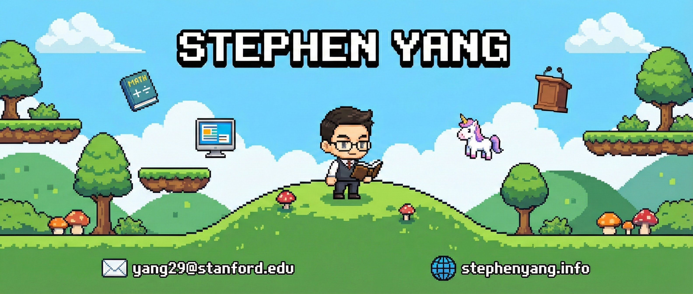

# Stephen Qingyuan Yang

**Software Engineer @ [Mechanize, Inc.](https://mechanize.work)** | Stanford Mathematics & Computer Science (On Leave)

Building reinforcement learning environments for software engineering agents. Previously researching LLMs, innovation economics, and political economy at Stanford.

---

### Research

My academic work sits at the intersection of AI/ML and social science:

- **AI & Innovation** — Using LLMs to predict patent value and understand innovation quality
- **Political Economy** — Modeling partisan voting behavior and legislative dynamics
- **Causal ML** — Detecting discrimination in patent systems with human+machine learning

**Selected Publications:**
- *Understanding Innovation Quality and Success with Large-Language Models* (2024)
- *Understanding Patenting Disparities via Causal Human+Machine Learning* (2024)
- *New Criteria for Triangle Similarity* — Mathematics Magazine (2025)

### Prior Work

**SuperScored.ai** (Co-founder & CEO) — AI-powered SAT preparation platform.

### Selected Achievements

- **Mathematics** — USAJMO 2x Honorable Mention; MathCounts Nationals, 8th Place
- **Policy Debate** — Tournament of Champions Qualifier; 29th Nationally
- **Speedcubing** — WCA Official 3x3 PB: 9.92s
- **Table Tennis** — Former professional training background

---

  
  

  

